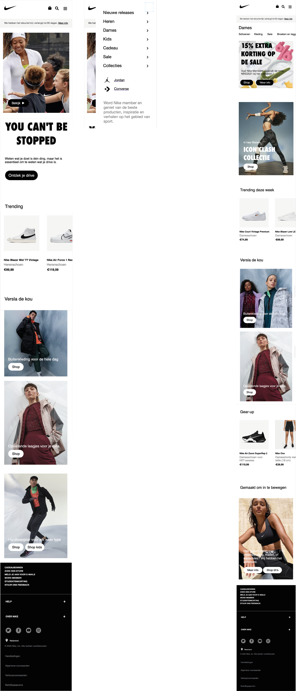
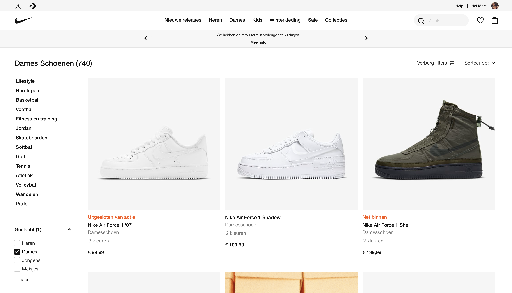

# Procesverslag
**Auteur:** -Merel Bouman-

Markdown cheat cheet: [Hulp bij het schrijven van Markdown](https://github.com/adam-p/markdown-here/wiki/Markdown-Cheatsheet). Nb. de standaardstructuur en de spartaanse opmaak zijn helemaal prima. Het gaat om de inhoud van je procesverslag. Besteedt de tijd voor pracht en praal aan je website.

## Bronnenlijst
1. https://codepen.io/RajRajeshDn/pen/RwrNPxx 
2. https://www.youtube.com/watch?v=v1PeTDrw6OY
3. https://kristjanjarv.com/kristjan_jarv_commercial_sport_photography/ 
4. https://www.nike.com/nl/ 
5. https://en.wikipedia.org/wiki/Jumpman_(logo)
6. https://1000merken.com/converse-logo/ 

7. Codepens van de oefeningen die op DLO staan 

## Eindgesprek (week 7/8)

-dit ging goed & dit was lastig-

**Screenshot(s):**
Eindresultaat

## Voortgang 3 (week 6)

### Stand van zaken

In de vakantie heb ik veel aan mijn code gezeten en ben daardoor vergeleken met wat ik eerst had aardig opgeschoten. Ik begin coderen langzaam maar zeker weer onder de knie te krijgen, maar loop nog wel vast met het uitlijnen. 

- Site was nog niet in de goede grootte voor mobiel. Ik heb een verkeerde scherm grootte gebruikt. 
- De header lijnt niet mooi uit en schuift niet goed mee
- Foto's staan nog niet volledig op de goede plek 

**Screenshot(s):**

-screenshot(s) van hoe ver je bent met korte uitleg-

### Agenda voor meeting

Met mijn groepje is niks afgesproken of besproken.

### Verslag van meeting

Justus heeft me geholpen met de werking van mijn header. Op de header is nu flex-box toegepast waardoor hij mooi uitlijnt en goed mee schuift. Ik wil nu deze zelfde manier toe gaan passen op mijn foto's.

## Voortgang 2 (week 5)

### Stand van zaken

Tijdens het tweede voortgangsgesprek kon ik helaas niet aanwezig zijn vanwege stage. Echter was ik ook nog steeds niet ver met mijn html en heb ik de tijd die ik na stage over had een beetje onderschat. Het waren drukke dagen waardoor ik vaak gestresst en moe was. Dit had ik in eerste instantie niet voorzien.

**Screenshot(s):**

-screenshot(s) van hoe ver je bent met korte uitleg-

### Agenda voor meeting

-samen met je groepje opstellen- Met mijn groepje is niks afgesproken of besproken.

### Verslag van meeting

nvt.

### KERSTVAKANTIE

27-12-2020

In de kerstvakantie ben ik eindelijk stappen gaan maken met mijn html code. Ik heb hiervoor veel filmpjes gekeken via youtube of verschillende codepens die online staan. 

29-12-2020

Het begrijpen van html en css gaat steeds beter. Ik krijg langzamer hand onder de knie welke elementen gebruikt kunnen/moeten worden en hoe ik de elementen kan stijlen.

02-01-2021

De home pagina van Nike begint er steeds meer op de lijken. Wel nog op de mobiele versie. Opmaak (goede lettertypen en kleur) en media queries moeten nog worden toegepast.

## Voortgang 1 (week 3)

### Stand van zaken

Voor het eerste voortgangsgesprek was ik nog totaal niet ver. Ik had zo goed als niks. Hierdoor heb ik ook geen vragen kunnen stellen. 

**Screenshot(s):**

-screenshot(s) van hoe ver je bent met korte uitleg-

### Agenda voor meeting

-samen met je groepje opstellen- Met mijn groepje is niks afgesproken of besproken.

### Verslag van meeting

Justus heeft mijn html gezien en voorgesteld om samen nog een keer te bellen om me op weg te helpen met de basis van html. Dit hebben we vervolgens samen gedaan wat ik erg fijn vond.

## Breakdownschets (week 1)

## Intake (week 1)
-uitwerken voor de kick-off werkgroep - begin van de eerste week-

**Je startniveau:** -heel blauw-

**Je focus:** -Ik denke surface plane, maar sluit responsive nog niet uit-

**Je opdracht:** -https://www.nike.com/nl/-

**Screenshot(s) van de eerste pagina (small screen):**

**Screenshot(s) van de tweede pagina (small screen):**

